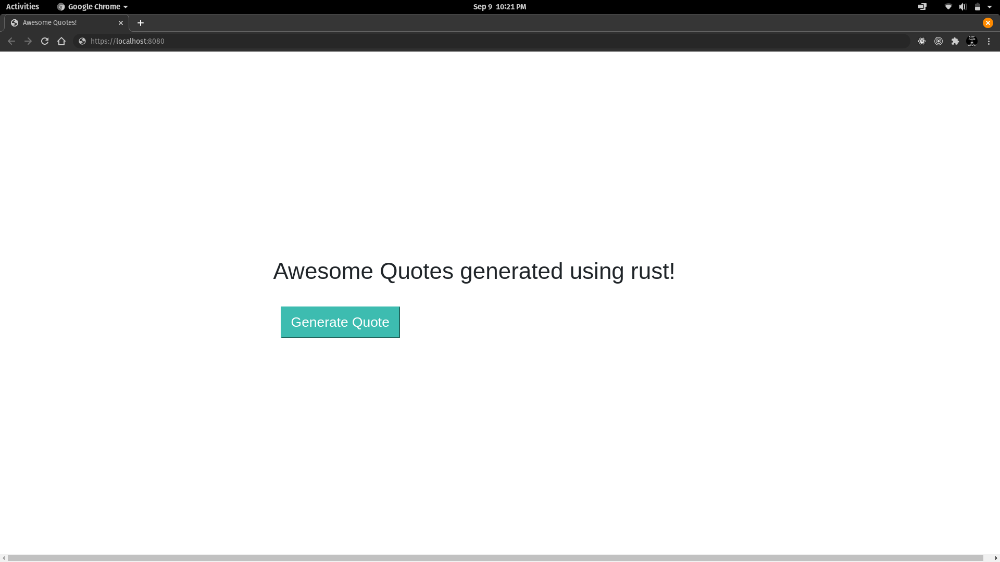
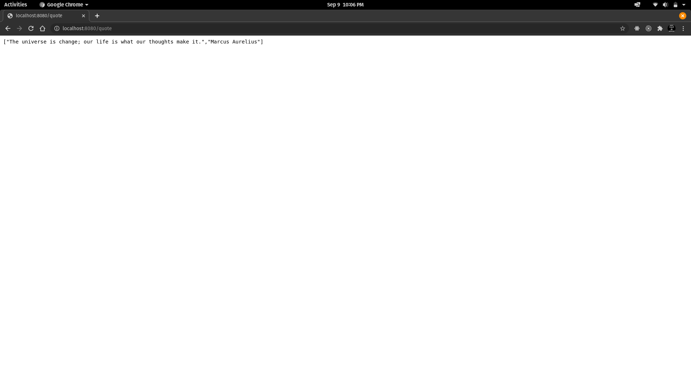

# The Quote Generator webapp

The app uses a rust function to generate a randomized quote.

## Previously faced issues

wasm-bindgen does not support lifetime specifiers ( &'static ). There is already an open issue [here](https://github.com/rustwasm/wasm-bindgen/issues/1187).\
Will change rust function to work around, soon.
<br/>
<br/>

## Prerequisites

If you have not done so already, follow these simple instructions to [install Rust, Node.js, SSVM, and ssvmup](https://www.secondstate.io/articles/setup-rust-nodejs/).

## Build the application

```
$ ssvmup build
```

## Web app

```
$ cd node
$ node server.js
Listening at http://localhost:8080
```

Then point your browser to `http://hostname:8080` and click on the generate button to recieve a new quote.



